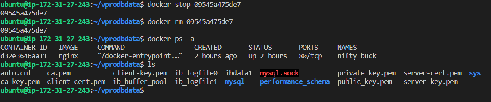

# Navigate to the Docker data directory
cd /var/lib/docker/

# List contents of the Docker data directory
ls

# List all Docker images
docker images
# Explanation: Lists all Docker images on the system.

# List all Docker containers
docker ps -a
# Explanation: Lists all Docker containers, including stopped ones.

# Stop and remove specific Docker containers
docker stop 498ec9a457ac 5a51c3c5aea8 9661acd8cd6a
docker rm 498ec9a457ac 5a51c3c5aea8 9661acd8cd6a
# Explanation: Stops and removes Docker containers with the specified IDs.

# List all Docker containers after removal
docker ps -a

# List all Docker images
docker images

# Remove Docker image by name
docker rmi mysql
# Explanation: Removes the Docker image named "mysql."

# Remove Docker image by ID
docker rmi bdba757bc933
# Explanation: Removes the Docker image with the specified ID.

# List all Docker images after removal
docker images

# Clear the terminal screen
clear

# Pull MySQL 5.7 image from Docker Hub
docker pull mysql:5.7
# Explanation: Downloads the MySQL 5.7 image from the official Docker Hub repository.

# List all Docker images
docker images

# Inspect Docker image by name
docker inspect mysql
# Explanation: Displays detailed information about the Docker image named "mysql."

# Inspect Docker image by name and tag
docker inspect mysql:5.7

# List contents of the current directory
ls

# Attempt to run Docker without specifying a command (incorrect)
docker run
# Explanation: This command is incomplete and needs additional parameters.

# List all Docker images
docker images

# Clear the terminal screen
clear

# Create a directory named "dockerdb"
mkdir dockerdb

# Run MySQL 5.7 container with specified options
docker run --name dockerdb -d -e MYSQL_ROOT_PASSWORD=admin123 -p 3030:3306 -v /home/ubuntu/vprodbdata:/var/lib/mysql mysql:5.7
# Explanation:
# - --name dockerdb: Sets the name of the Docker container.
# - -d: Runs the container in detached mode.
# - -e MYSQL_ROOT_PASSWORD=admin123: Sets the environment variable for the MySQL root password.
# - -p 3030:3306: Maps host port 3030 to container port 3306.
# - -v /home/ubuntu/vprodbdata:/var/lib/mysql: Mounts the host directory to the container directory for persistent data storage.
# - mysql:5.7: Specifies the Docker image to use.

# command with the proper syntax for volume mapping
docker run --name dockerdb -d -e MYSQL_ROOT_PASSWORD=admin123 -p 3030:3306 -v /home/ubuntu/vprodbdata:/var/lib/mysql mysql:5.7

# Alternative command with corrected syntax for volume mapping and port mapping
docker run --name dockerdb -d -e MYSQL_ROOT_PASSWORD=admin123 -p 3030:3306 -v /home/ubuntu/vprodbdata:/var/lib/mysql mysql:5.7
# Explanation: Provides an alternative command with corrected syntax for both volume mapping and port mapping.

  # docker ps -a
  # docker exec -it dockerdb /bin/bash

# ip:~/vprodbdata$ ls
auto.cnf    ca.pem           client-key.pem  ib_logfile0  ibdata1  mysql       performance_schema  public_key.pem   server-key.pem
ca-key.pem  client-cert.pem  ib_buffer_pool  ib_logfile1  ibtmp1   mysql.sock  private_key.pem     server-cert.pem  sys

# result in bash

bash-4.2# cd /var/lib/mysql
bash-4.2# ls
auto.cnf    ca.pem           client-key.pem  ib_logfile0  ibdata1  mysql       performance_schema  public_key.pem   server-key.pem
ca-key.pem  client-cert.pem  ib_buffer_pool  ib_logfile1  ibtmp1   mysql.sock  private_key.pem     server-cert.pem  sys

ubuntu@ip:~/vprodbdata$ docker stop 09545a475de7
09545a475de7
ubuntu@ip:~/vprodbdata$ docker rm 09545a475de7
09545a475de7
ubuntu@ip:~/vprodbdata$ docker ps -a
CONTAINER ID   IMAGE     COMMAND                  CREATED       STATUS       PORTS     NAMES
d32e3646aa11   nginx     "/docker-entrypoint.…"   2 hours ago   Up 2 hours   80/tcp    nifty_buck
ubuntu@ip:~/vprodbdata$ ls 
auto.cnf    ca.pem           client-key.pem  ib_logfile0  ibdata1  mysql.sock          private_key.pem  server-cert.pem  sys
ca-key.pem  client-cert.pem  ib_buffer_pool  ib_logfile1  mysql    performance_schema  public_key.pem   server-key.pem
ubuntu@ip:~/vprodbdata$ 

# ################ Create VOLUME ###################

# create volume 
docker volume create mynewdb

# docker run the mysql 

docker run --name newdockerdb -d -e MYSQL_ROOT_PASSWORD=admin123 -p 3030:3306 -v mynewdb:/var/lib/mysql mysql:5.7

su - root

# /var/lib/docker/volumes/mynewdb/_data/

root@ip-172-31-27-243:~# ls /var/lib/docker/volumes/mynewdb/
_data
root@ip-172-31-27-243:~# ls /var/lib/docker/volumes/mynewdb/_data/
auto.cnf    ca.pem           client-key.pem  ib_logfile0  ibdata1  mysql       performance_schema  public_key.pem   server-key.pem
ca-key.pem  client-cert.pem  ib_buffer_pool  ib_logfile1  ibtmp1   mysql.sock  private_key.pem     server-cert.pem  sys

### docker inspect newdockerdb

"LogPath": "/var/lib/docker/containers/f4fa9d787f432540d373d51c90d056d239f96110f9c46886405e4c936cd36acb/f4fa9d787f432540d373d51c90d056d239f96110f9c46886405e4c936cd36acb-json.log",

            "WorkingDir": "",
            "Entrypoint": [
                "docker-entrypoint.sh"
            ],

"HostConfig": {
            "Binds": [
                "mynewdb:/var/lib/mysql"
            ],
            "ContainerIDFile": "",
            "LogConfig": {
                "Type": "json-file",
                "Config": {}
            },
            "NetworkMode": "default",
            "PortBindings": {
                "3306/tcp": [
                    {
                        "HostIp": "",
                        "HostPort": "3030

cotainter have ip addr
u can ping but not outside network

# ####################################

# fetch ip 

docker inspect -f '{{range .NetworkSettings.Ports}}{{.}}{{end}}' <container_id_or_name>
# mysql -h 172.17.0.2 -u root -padmin123 connects to a MySQL
mysql -h 172.17.0.2 -u root -padmin123

# Connect to MySQL server at IP address 172.17.0.2 as the root user, prompting for the password "admin123"
mysql -h 172.17.0.2 -u root -padmin123
# Explanation: Initiates a connection to a MySQL server running at the specified IP address (172.17.0.2).
# Uses the root user for authentication and prompts for the password "admin123."
# If successful, opens a MySQL command-line shell for interaction with the MySQL server.

