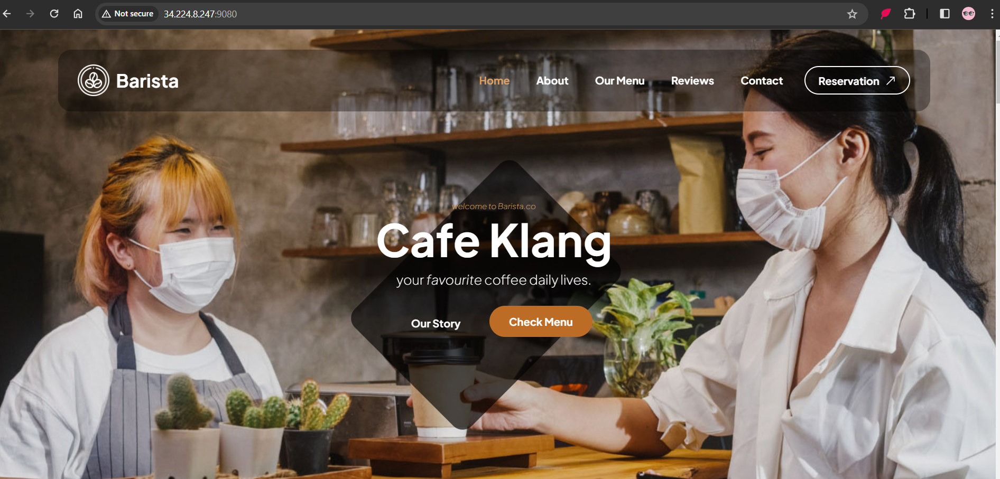

# Build Image
docker pull dockerlrnz1/cafeimg

https://www.tooplate.com/zip-templates/2137_barista_cafe.zip

# ##Take build image from my repo##
docker pull dockerlrnz1/cafeimg

### install.sh file and start deployment 

# Download the webpage source code in a zip file from the specified URL
wget https://www.tooplate.com/zip-templates/2137_barista_cafe.zip

# Unzip the downloaded zip file
unzip 2137_barista_cafe.zip

# List the contents of the extracted directory
ls 2137_barista_cafe/

# Change into the directory containing the extracted files
cd 2137_barista_cafe/

# Create a compressed tar archive (tar.gz) of all files in the directory
tar czvf barista.tar.gz *

# Move the tar archive to the parent directory
mv barista.tar.gz ../

# List the contents of the parent directory
ls ../

# Change to the home directory
cd

# Copy the tar archive to the specified directory (assumes 'images/cafe/' exists)

cp barista.tar.gz images/cafe/

# Change into the target directory
cd images/cafe/

# Edit the Dockerfile to specify the image configuration (e.g., dependencies, commands)
vim Dockerfile

# /images/cafe# ls
Dockerfile  barista.tar.gz

# Build a Docker image with the specified tag 'cafeimg' using the current directory as the build context
docker build -t cafeimg .

# List the currently running Docker containers
docker ps

# List all Docker containers (both running and stopped)
docker ps -a

# Incorrect command (typo): 'docker imahes' should be 'docker images'
docker images

# Run a Docker container in detached mode (-d) named 'cafewebsite,' mapping host port 9080 to container port 80

docker run -d --name cafewebsite -p 9080:80 cafeimg

# List Docker images to verify the image ID of your 'cafeimg' image
docker images

# Tag your 'cafeimg' image with a new tag 'dockerlrnz1/cafeimg:version2.0'
docker tag cafeimg dockerlrnz1/cafeimg:version2.0

# List Docker images again to verify the new tag
docker images

# Push the tagged image to Docker Hub
docker push dockerlrnz1/cafeimg:version2.0

# Tag your image with your Docker Hub username/repository and version
docker tag cafeimg dockerlrnz1/cafeimg:version1.0

# Log in to Docker Hub
docker login

# Push your Docker image to Docker Hub
docker push yourdockerhubusername/cafeimg:version1.0

#  once uploaded to repo, use below command to pull and run

docker run -d --name cafewebsite -p 9080:80 dockerlrnz1/cafeimg:version2.0

